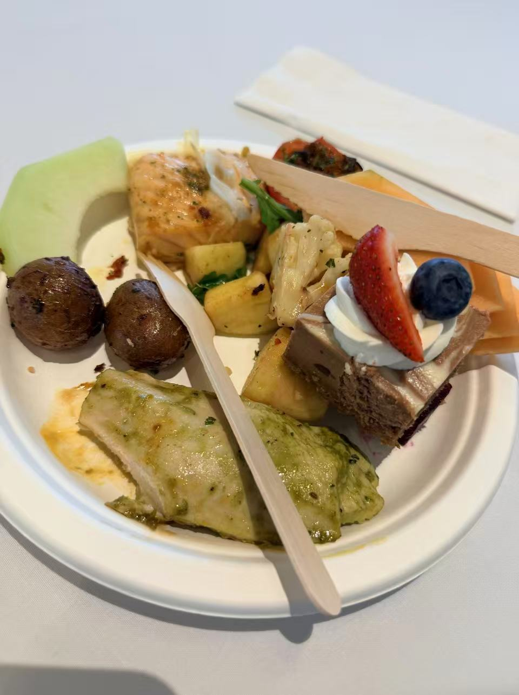

We joined the MDS 3 days orientation between 8.26 to 8.28. During the orientation we met a lot of MDS students with different background. Also, we have been told a bunch of important information and policy about this program.

On the other hand, we have a fun activity which called Campus Goose Chase Team Building on the second day of the orientation. We had a campus tour with our assigned group members and did some fun challenge together.

Finally, we have a really good welcome dinner together. The food is really delicious which shows in the post.

